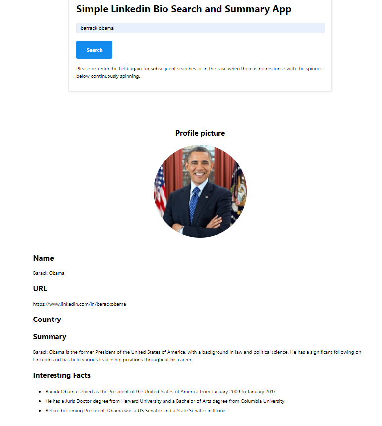

# Simple Linkedin Bio Search and Summary App

This is a simple app developed as part of learning LLM development experience, where one could simply input in the frontend web app on a person of interest and retireve a likely Linkedin page with a short summary and three interesting facts included.

**Disclaimer**: Accuracy and quickness of results are not guaranteed and immediate as this is just a simple exploratory development project. 

## Sample frontend


## API used

Please note that the following API requires the use of API key to work and are not free.
- *Proxycurl* for scraping Linkedin Profile page (https://nubela.co/proxycurl/).
- *Tavily Search* for performing efficient, quick and persistent search based on input (https://docs.tavily.com/docs/welcome).
- *Langchain's ChatOpenAi* to chat with OpenAI's GPT-3.5-Turbo model (https://api.python.langchain.com/en/latest/chat_models/langchain_openai.chat_models.base.ChatOpenAI.html).

## Environment file to edit
Please update the *.env* file with the following parameters. PYTHONPATH is required to be filled to ensure successful folder imports in project.

```
OPENAI_API_KEY=<YOUR API KEY>
PROXYCURL_API_KEY=<YOUR API KEY>
TAVILY_API_KEY=<YOUR API KEY>
PYTHONPATH=<Absolute path to the directory where this project is cloned>
```

## Installation and execution
Please use Anaconda distribution to install the necessary libraries with the following command

```
conda env create -f environment.yml
```

Upon installation and environment exectuion, do run the following command

```
python <Path to project repo>/app.py
```

## Programming languages involved
- Python
- HTML/CSS

## Acknowledgement and Credits

The codebase developed are in reference to Udemy course titled "LangChain- Develop LLM powered applications with LangChain" available via https://www.udemy.com/course/langchain.